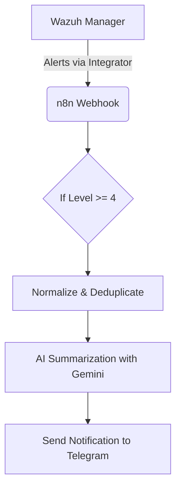

# Wazuh + n8n Mini SOAR Workflow

This repository contains an advanced n8n workflow that acts as a mini Security Orchestration, Automation, and Response (SOAR) platform. It integrates with Wazuh to process security alerts, enriches them using AI, and sends notifications for immediate review.

## 🌟 Features

- **Real-time Alert Processing:** Ingests alerts directly from Wazuh via webhooks.
- **Intelligent Triage:** Filters alerts based on severity level.
- **Deduplication & Normalization:** Cleans and structures raw Wazuh data, and prevents alert spam.
- **AI-Powered Summarization:** Uses Google Gemini to analyze the alert and provide a concise, actionable summary.
- **Automated Notifications:** Delivers the AI-generated summary to a Telegram chat.

## 🏗️ Architecture

## 🛠️ Prerequisites

- A running Wazuh Manager instance.
- A running n8n instance.
- A Telegram Bot token and Chat ID.
- A Google Gemini API key.

## 🚀 Setup

1.  **Sanitize the Workflow:** Before importing, open the `workflow.json` file in a text editor and replace placeholders like `YOUR_TELEGRAM_CHAT_ID` with your actual values.
2.  **Import Workflow:** Import the `workflow.json` file into your n8n instance.
3.  **Configure Credentials:** In the n8n UI, create new credentials for your Telegram Bot and Google Gemini API.
4.  **Link Credentials:** Open each node in the workflow and select the credentials you created.
5.  **Activate Workflow** and configure Wazuh to send alerts to your new n8n webhook URL.

## 📄 License

This project is licensed under the MIT License.
